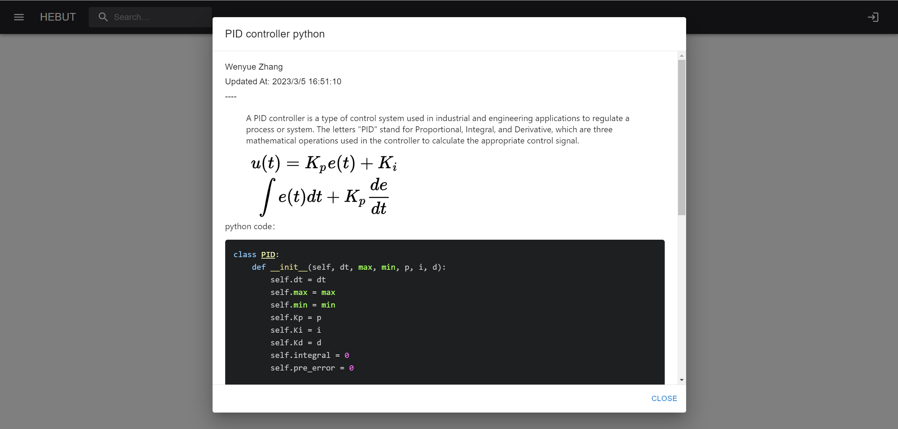
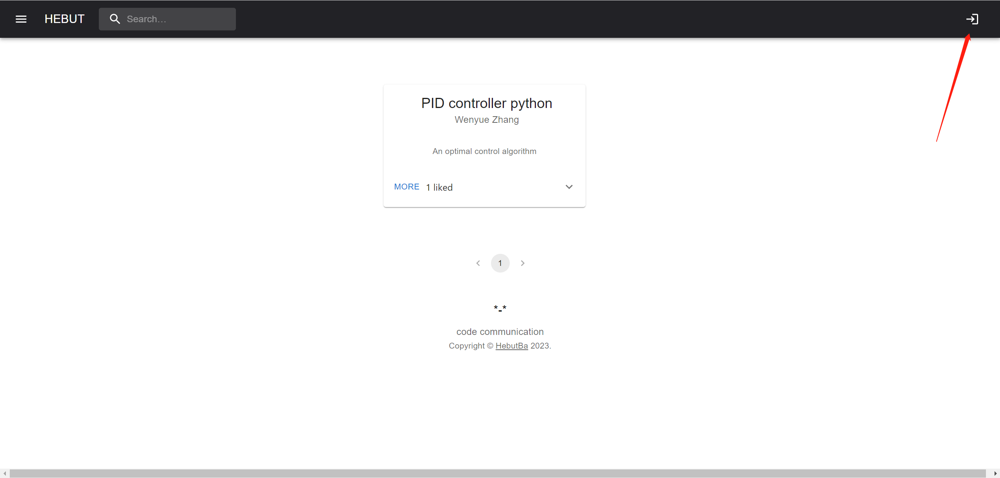
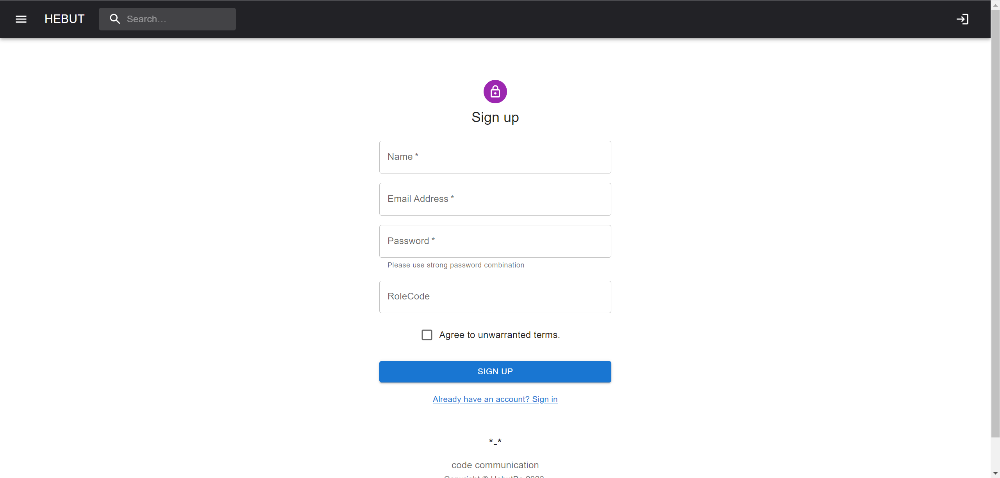
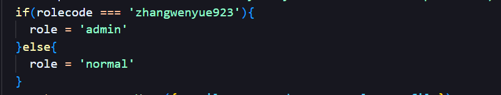

# HEBUTba

forum of hebut



## echnology selection

### Backend:

For the backend, Node.js was used as the primary technology. Node.js is a popular open-source server-side runtime environment that allows developers to build scalable and high-performance web applications using JavaScript. The reason for choosing Node.js is that it provides a non-blocking I/O model, making it ideal for building fast and scalable web applications. 

For the web framework, Express.js was chosen. Express.js is a popular open-source web framework for Node.js that simplifies the process of building web applications. It provides a minimalist approach to web development, allowing developers to build scalable and efficient applications quickly.

For data storage, MongoDB was chosen. MongoDB is a NoSQL document-oriented database that provides high performance, scalability, and flexibility. It allows developers to store and retrieve data in JSON-like documents, making it easy to work with data.

### Authentication and Authorization:

For authentication and authorization, JSON Web Tokens (JWT) were used by me. JWT is an open standard for securely transmitting information between parties as a JSON object. It is widely used for authentication and authorization purposes in web applications. 

### Frontend:

For the frontend, a front-end framework such as React was used. This frameworks provide a set of tools and libraries for building scalable and efficient web applications. They provide a component-based architecture, making it easy to build reusable and maintainable code.

For styling, Materialize was uesd. This is popular CSS frameworks that provide a set of pre-designed UI components that can be easily customized to match the application's design requirements.
## features(51 points)：
- [x] Basic features
- [x] Users can edit their own comments/posts
- [x] Utilization of a frontside framework, React
- [x] Use some highlight library for the code snippets(ReactMarkdown)
- [x] Use of a pager when there is more than n posts available
- [x] Admin account with rights to edit all the post and comments and delete content (if a post is removed, all its comments should be removed too)
- [x] Vote (up or down) posts and comments (only one vote per user)
- [x] User profiles can have images which are show next to posts
- [x] Last edited timestamp is stored and shown with posts/comments

## installation guidelines

### Installation dependency
Enter the root directory
```
npm install
```
then
```
npm preinstall
```
### Run
Start the server end in development mode
```
SET NODE_ENV=development& npm run dev:server
```
then start the front end
```
npm run dev:client
```
## user manual
#### Sign in

Click here to log in. You cannot comment or post codeSnippet without logging in.

#### Sing up


Sign up interface.
Please note that your password type must be a strong password combination (at least one uppercase and lowercase letter, and contain numbers and special symbols)

  
You can obtain the identity of the administrator by entering the administrator code defined on the server (delete anyone's posts and comments)

####
